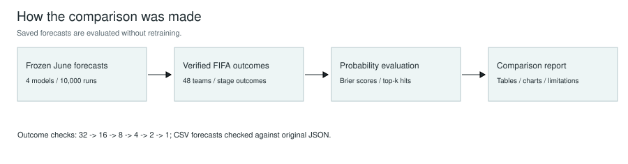
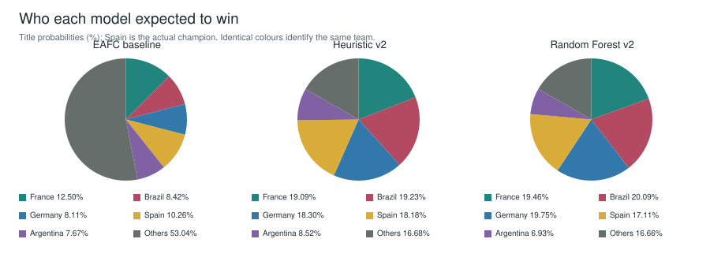
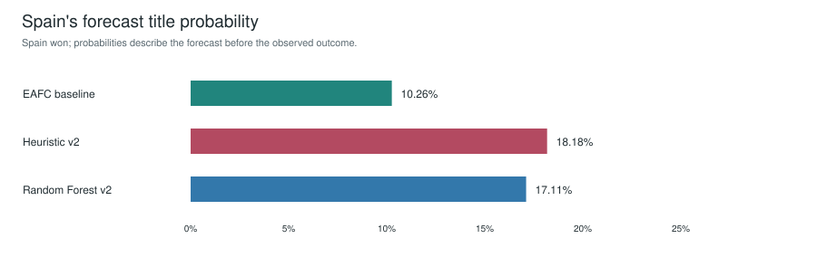
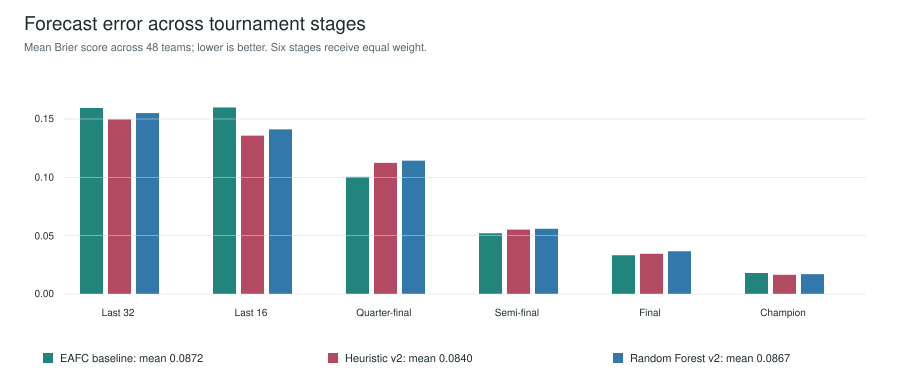
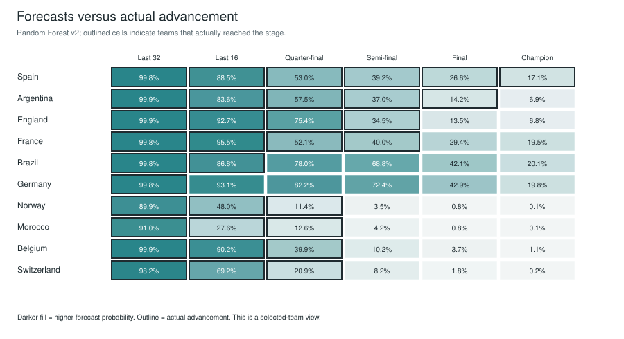

# FIFA World Cup 2026: simulation versus actual results

Full research report: [comprehensive LaTeX PDF](comprehensive_report.pdf), including abstract, contents, model introductions and dataset provenance. [Dataset source register](dataset_sources.csv).

Prepared 8 October 2026. Evaluation of frozen June outputs; no models were retrained for this comparison.

## Actual outcome

Spain beat Argentina 1-0 after extra time. England took third place and France fourth. Kylian Mbappé won the Golden Boot with 10 goals. See the linked FIFA sources below and actual_outcomes.json for all stage memberships.

## Main findings

None of the three primary models ranked Spain first, although all placed Spain in their leading contenders. The baseline favoured France; both v2 variants favoured Brazil. The actual champion therefore had meaningful forecast support, but the favourite was wrong. Across the six advancement stages, v2_heuristic_nt_elo has the lowest mean Brier score (0.0840) in this tournament.

## Charts and diagrams

### Evaluation workflow

Frozen predictions and sourced outcomes feed the same scoring process.

### Champion probability distributions

Each pie totals 100%. Others combines all teams outside the five named contenders.

### Spain's title chances

Baseline: 10.26%; heuristic v2: 18.18%; Random Forest v2: 17.11%.

### Stage accuracy

Heuristic v2 has the lowest combined advancement error in this tournament. Stage base rates differ, so compare models within a stage.

### Forecasts and actual advancement

Germany and Brazil had high predicted advancement, while Norway and Morocco exceeded their forecasts.

## Champion forecasts

| model | primary | predicted_winner | spain_rank | spain_champion_pct | champion_log_loss | champion_brier_sum |
| --- | --- | --- | --- | --- | --- | --- |
| primitive_eafc_poisson | True | France | 2 | 10.2600 | 2.2769 | 0.8641 |
| v2_heuristic_nt_elo | True | Brazil | 4 | 18.1800 | 1.7048 | 0.7903 |
| v2_random_forest_nt_elo | True | Brazil | 4 | 17.1100 | 1.7655 | 0.8169 |
| v2_random_forest_squad_proxy_legacy | False | France | 2 | 14.3800 | 1.9393 | 0.8704 |

## Stage evaluation

| model | stage | brier_mean | brier_skill | top_k_hits | k |
| --- | --- | --- | --- | --- | --- |
| primitive_eafc_poisson | round_of_32 | 0.1594 | 0.2826 | 27 | 32 |
| primitive_eafc_poisson | round_of_16 | 0.1599 | 0.2804 | 11 | 16 |
| primitive_eafc_poisson | quarter_finals | 0.1004 | 0.2770 | 4 | 8 |
| primitive_eafc_poisson | semi_finals | 0.0521 | 0.3184 | 2 | 4 |
| primitive_eafc_poisson | final | 0.0332 | 0.1683 | 1 | 2 |
| primitive_eafc_poisson | champion | 0.0180 | 0.1175 | 0 | 1 |
| primitive_eafc_poisson | third_place | 0.0190 | 0.0699 | 0 | 1 |
| primitive_eafc_poisson | fourth_place | 0.0197 | 0.0330 | 0 | 1 |
| v2_heuristic_nt_elo | round_of_32 | 0.1497 | 0.3263 | 27 | 32 |
| v2_heuristic_nt_elo | round_of_16 | 0.1357 | 0.3892 | 11 | 16 |
| v2_heuristic_nt_elo | quarter_finals | 0.1124 | 0.1909 | 4 | 8 |
| v2_heuristic_nt_elo | semi_finals | 0.0552 | 0.2775 | 2 | 4 |
| v2_heuristic_nt_elo | final | 0.0345 | 0.1368 | 0 | 2 |
| v2_heuristic_nt_elo | champion | 0.0165 | 0.1929 | 0 | 1 |
| v2_heuristic_nt_elo | third_place | 0.0187 | 0.0835 | 0 | 1 |
| v2_heuristic_nt_elo | fourth_place | 0.0211 | -0.0361 | 0 | 1 |
| v2_random_forest_nt_elo | round_of_32 | 0.1551 | 0.3023 | 27 | 32 |
| v2_random_forest_nt_elo | round_of_16 | 0.1411 | 0.3650 | 11 | 16 |
| v2_random_forest_nt_elo | quarter_finals | 0.1143 | 0.1770 | 4 | 8 |
| v2_random_forest_nt_elo | semi_finals | 0.0559 | 0.2681 | 2 | 4 |
| v2_random_forest_nt_elo | final | 0.0366 | 0.0825 | 0 | 2 |
| v2_random_forest_nt_elo | champion | 0.0170 | 0.1658 | 0 | 1 |
| v2_random_forest_nt_elo | third_place | 0.0174 | 0.1449 | 0 | 1 |
| v2_random_forest_nt_elo | fourth_place | 0.0211 | -0.0342 | 0 | 1 |

## Combined advancement score

| model | mean_six_stage_brier |
| --- | --- |
| primitive_eafc_poisson | 0.0872 |
| v2_heuristic_nt_elo | 0.0840 |
| v2_random_forest_nt_elo | 0.0867 |

## Biggest discrepancies

| model | team | stage | forecast_pct | actual_reached | absolute_error |
| --- | --- | --- | --- | --- | --- |
| v2_heuristic_nt_elo | Norway | quarter_finals | 10.3800 | 1 | 0.8962 |
| v2_random_forest_nt_elo | Norway | quarter_finals | 11.4100 | 1 | 0.8859 |
| v2_random_forest_nt_elo | Morocco | quarter_finals | 12.6100 | 1 | 0.8739 |
| primitive_eafc_poisson | Argentina | final | 13.8600 | 1 | 0.8614 |
| v2_random_forest_nt_elo | Argentina | final | 14.1600 | 1 | 0.8584 |
| v2_heuristic_nt_elo | Morocco | quarter_finals | 15.6600 | 1 | 0.8434 |
| v2_heuristic_nt_elo | Argentina | final | 17.2500 | 1 | 0.8275 |
| primitive_eafc_poisson | Spain | final | 17.7700 | 1 | 0.8223 |
| v2_random_forest_nt_elo | Germany | quarter_finals | 82.2300 | 0 | 0.8223 |
| primitive_eafc_poisson | Morocco | quarter_finals | 19.8900 | 1 | 0.8011 |
| primitive_eafc_poisson | Norway | quarter_finals | 19.9000 | 1 | 0.8010 |
| v2_heuristic_nt_elo | Germany | quarter_finals | 79.8300 | 0 | 0.7983 |

Germany exited in the round of 32 and Brazil in the round of 16, despite strong v2 forecasts. Norway, Morocco, Belgium and Switzerland reached the quarter-finals. These outcomes expose the concentration of probability on stronger rated teams. They suggest reviewing upset frequency, bracket effects and data coverage; one tournament cannot establish which mechanism caused an error.

## Golden Boot comparison

| model | mbappe_scorer_rank | predicted_mean_goals | actual_goals |
| --- | --- | --- | --- |
| primitive_eafc_poisson | 2 | 1.4460 | 10 |
| v2_heuristic_nt_elo | 1 | 2.9459 | 10 |
| v2_random_forest_nt_elo | 1 | 2.9035 | 10 |
| v2_random_forest_squad_proxy_legacy | 1 | 3.4672 | 10 |

Scorer rank is based on expected aggregate goals, not the probability of winning the Golden Boot. A player's mean over many tournaments is different from their observed goals in a single tournament. This is a descriptive comparison, not a calibrated award forecast.

## Method and interpretation

Each saved percentage is divided by 100 and compared with a binary indicator of reaching that stage, across all 48 teams. Brier mean is mean((p-y)^2); lower is better. Brier skill compares with a uniform stage probability k/48. Top-k hits measures overlap between the k highest forecast teams and the k actual qualifiers. Equal probabilities use alphabetical ordering. Champion log loss is -ln(P(Spain)); champion Brier is the sum across 48 mutually exclusive outcomes. The six-stage aggregate gives equal weight to reaching the round of 32, round of 16, quarter-finals, semi-finals, final and winning. Bronze results are excluded from that aggregate. Advancement outcomes are dependent, so these scores are descriptive and do not imply 288 independent observations.

## Forecast provenance and limits

Each compared model ran 10,000 tournaments. The two primary v2 outputs used FIFA-rank-derived Elo-scale priors, not the raw World Football Elo file imported later. The legacy squad-proxy model is reported separately from the primary comparison. Training used synthetic profile calibration; historical-match predictive accuracy was not established. Seeds whose numbers resemble later dates are random-number seeds, not creation timestamps. Local file timestamps do not prove that forecasts were published before kickoff: the artifacts were saved around the start of the tournament, and v2 files were last modified on 11 June. Treat this as retrospective evaluation of saved forecasts, not an independently audited pre-tournament backtest. Do not rerun using post-tournament inputs and label those outputs original predictions.

Wilson intervals in earlier reports measure Monte Carlo sampling error conditional on the model; they do not capture uncertainty about football assumptions. One observed tournament cannot establish calibration or statistical superiority. Saved files do not provide probabilities for every actual match or every player, so match-level log loss, full player-goal error and causal attribution are outside this report. Group-exit membership is inferred from absence in the verified round-of-32 field. Exact final rankings among teams eliminated at the same stage are not inferred.

## Next research steps

1. Backtest on multiple historical tournaments using team and player information available at each match date.
2. Calibrate draw, goal and upset rates on real international results.
3. Check bracket routing and stronger-team probability concentration.
4. Improve low-confidence player coverage and evaluate Golden Boot probabilities separately from mean goals.
5. Publish dated forecast snapshots before future tournaments.

## Reproduce and audit

Run `python compare_simulation_with_actuals.py` from the repository root. Inputs: simulation_10000_model_comparison CSV files and the four frozen simulation_results JSON files. Outputs: this report, a printable HTML version, model scores, all team-stage comparisons, champion and scorer tables, plus SHA-256 hashes of the frozen predictions. Source-name mappings are recorded in actual_outcomes.json.

## Sources

- [knockouts](https://www.fifa.com/en/articles/knockout-stage-match-schedule-bracket?searchOverlay=1)
- [standings](https://www.fifa.com/en/articles/final-tournament-standings)
- [awards](https://www.fifa.com/en/articles/lessons-from-frances-2026-world-cup-campaign)
- [final](https://inside.fifa.com/organisation/news/new-york-jersey-stadium-spain-world-champions-mbappe-haaland)
